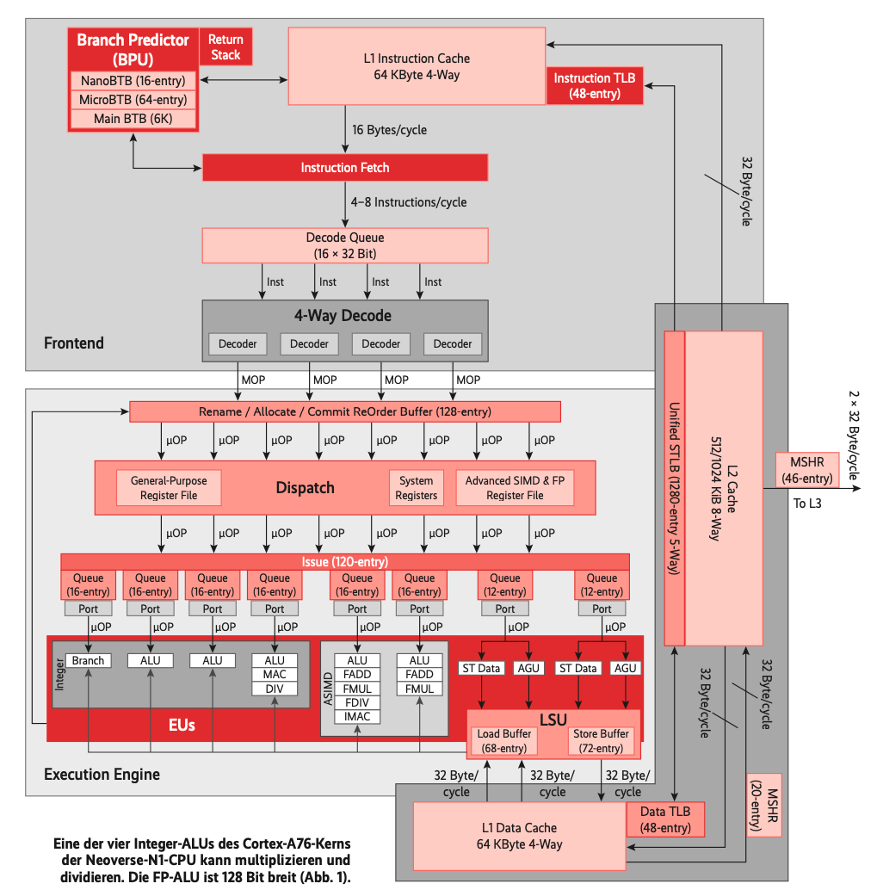
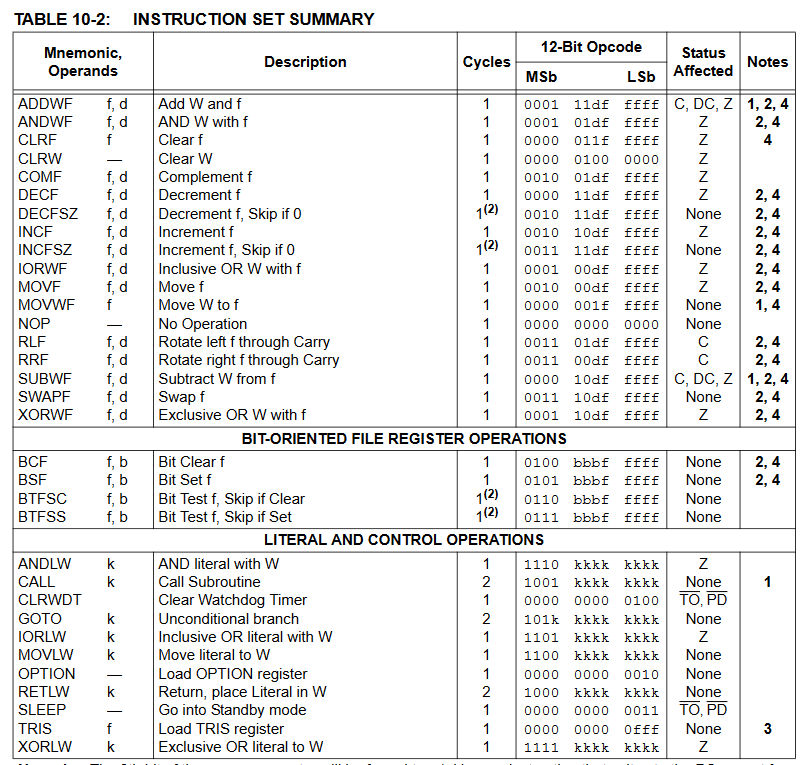
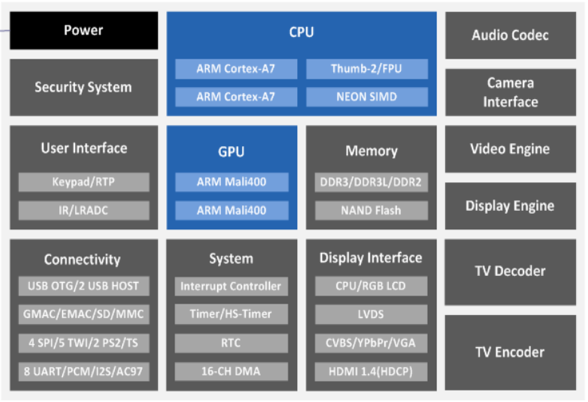

# Übung CPU Architektur

1. Erkläre die folgenden Blöcke des untenstehenden Blockschaltbilds eines ARM Cortex-A76 Prozessor-Cores:
    - Instruction Fetch
    - Branch Predictor
    - ALU
    - L1 Instruction Cache
      
2. Erkläre anhand obigem Blockschaltbild, wie eine CPU eine Addition von zwei Ganzzahlen ausführt.

3. Die folgende Abbildung zeigt den ganzen Befehlssatz eines PIC10 Microcontrollers.
   Handelt es sich dabei um einen RISC oder CISC-Prozessor? Begründe!
   
4. Abgebildet ist ein Blockschaltbild von einem System on Chip (SoC).
   - Erkläre den Begriff SoC im Gegensatz zu einer General Purpose CPU.
   - Das System verfügt über verschiedene spezialisierte Co-Prozessoren.
   Was ist vermutlich das Einsatzgebiet von diesem SoC?
   