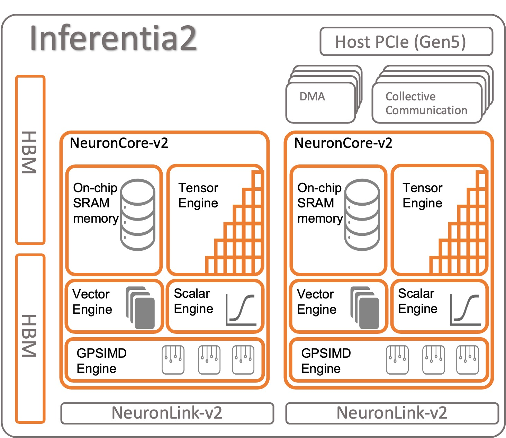
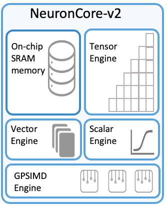

# GPU Lösungen

## Cloud Computing

Der Inferentia v2 ist für Machine Learning-Anwendungen konzipiert und basiert auf der "NeuronCore-v2" Architektur.

Der Chip ermöglicht mit seine spezialisierten Rechenwerken die schnelle Berechnung von verschiedenen Rechenoperationen:

- Tensor Engine: Performs tensor computations such as Conv, Reshape, Transpose, and others. (Matrix-Operationen)
- Vector Engine: Operates on vectors of numbers with single operation for computations such as normalization, 
  pooling, and others (Vektor-Operationen)
- Skalar Engine: Operates on floating point numbers––1600 (BF16/FP16) FLOPS (Einzelne Zahlen, Skalar-Operationen)
- GPSIMD-Engine: Has eight fully programmable 512-bit wide general-purpose processors for you to create your custom 
  operators with standard PyTorch custom C++ operators API.

Two NeuronCore-v2 delivering 380 INT8 TOPS, 190 FP16/BF16/cFP8/TF32 TFLOPS, and 47.5 FP32 TFLOP.

Datentypen:

- 32 and 16-bit Floating Point (FP32 / FP16)
- TensorFloat-32 ([TF32](https://en.wikipedia.org/wiki/TensorFloat-32))
- Brain Floating Point (BFloat16)
- 8-bit Floating point with configurable range and precision (cFP8)
- Unsigned 8-bit integer (UINT8)

### Memory

Auf dem Inferentia Chip befinden sich 32GB sogenanntes High Bandwith Memory (HBM) mit 820GB/s Datenübertragungsrate, 
was mehr als 10x schneller ist als DDR4 RAM.

Zusätzlich verfügen die beiden NeuronCores je über einen eigenen SRAM, um eine sehr hohe 
Speicherzugriffsgeschwindigkeit zu erreichen. Bei den v3 NeuronCores ist das on-chip SRAM mit 28MB angeben, für die 
v2 ist keine Angabe auffindbar.

### Interface

Schnittstelle: NeuronLink mit 384 GB/s Datenübertragungsrate.

Die Trainium Chips sind den Inferentia sehr ähnlich, verfügen aber über vier NeuronLink-v2 Schnittstellen.

https://aws.amazon.com/de/blogs/machine-learning/aws-inferentia2-builds-on-aws-inferentia1-by-delivering-4x-higher-throughput-and-10x-lower-latency/

AWS Trainium Architecture
: https://awsdocs-neuron.readthedocs-hosted.com/en/latest/general/arch/neuron-hardware/trainium.html

