<!-- headingDivider: 4 -->
<style>
img {
  display: block;
  margin: 0 auto;
}
</style>

# Microcomputertechnik

## Software

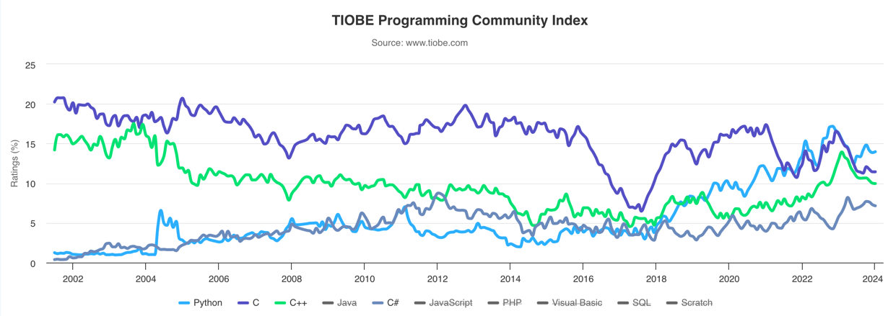

---


Ken Thompson, Dennis Ritchie

### C Keywords (Auswahl)

```
bool (C23)   extern        sizeof         default     return
false (C23)  float         static         do          volatile
break        for           struct         double      short
case         goto          switch         else        signed
char         if            true (C23)     unsigned    register
const        int           typedef        void        union
continue     long                       
```

### Python Keywords

```
False 	     await        else         import        pass
None 	     break        except       in            raise
True 	     class        finally      is            return
and          continue     for          lambda        try
as           def          from         nonlocal      while
assert 	     del          global       not           with
async 	     elif         if           or            yield
```

### Go Keywords

```
break        default      func         interface    select
case         defer        go           map          struct
chan         else         goto         package      switch
const        fallthrough  if           range        type
continue     for          import       return       var
```

https://go.dev/ref/spec#Keywords

## Aufbau und Funktion eines Microprozessors

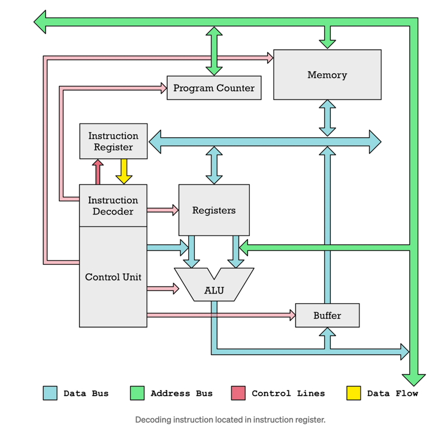

https://erik-engheim.medium.com/how-does-a-microprocessor-run-a-program-11744ab47d04

### AVR Architektur Blockschaltbild

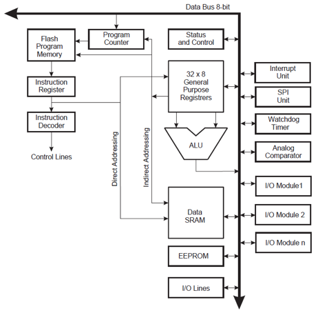

### 1971: Intel 4004

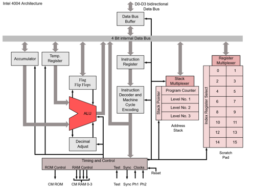

### AMD Threadripper

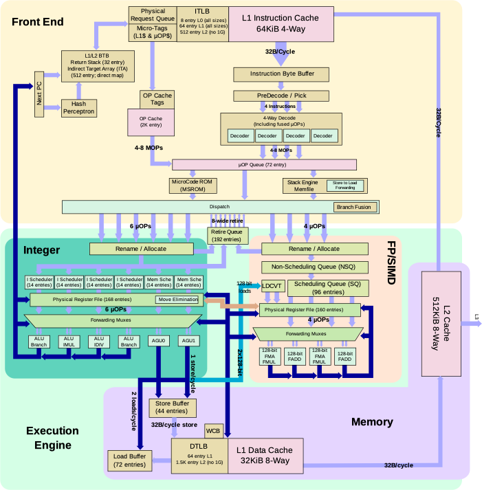

### Fetch - Decode - Execute

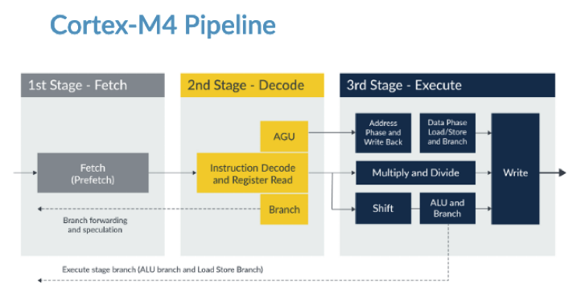

### Arithmetic Logic Unit (ALU)

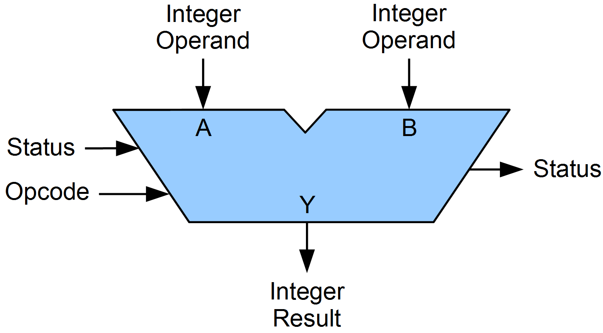

Mindestens:

* Addition (ADD)
* Negation (NOT)
* Konjunktion (AND)

Zusätzlich (Auswahl):

* Subtraktion
* Vergleich
* Multiplikationen / Division
* Oder
* Shift / Rotation

## Instruction Set

### OP-Code

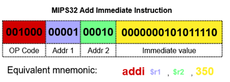

http://lyons42.com/AVR/Opcodes/AVRAllOpcodes.html

### A64 Instruction Set

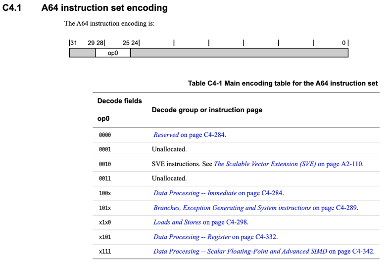
--- 
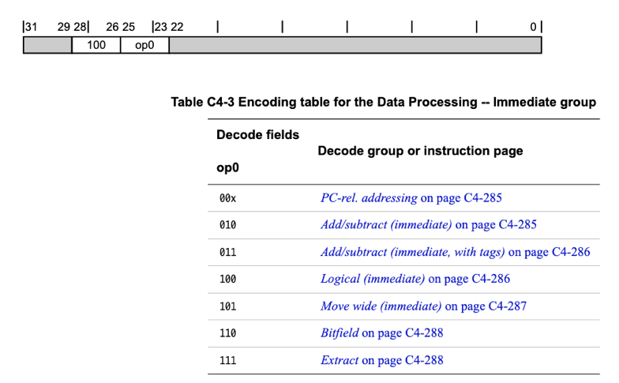
---
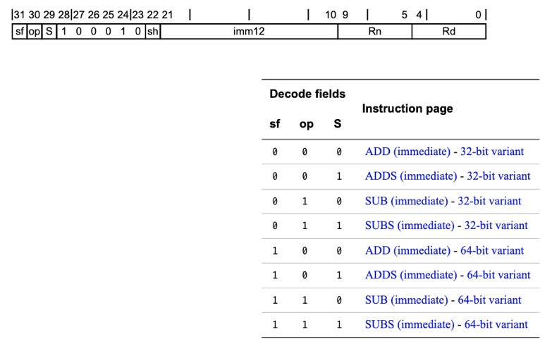
---
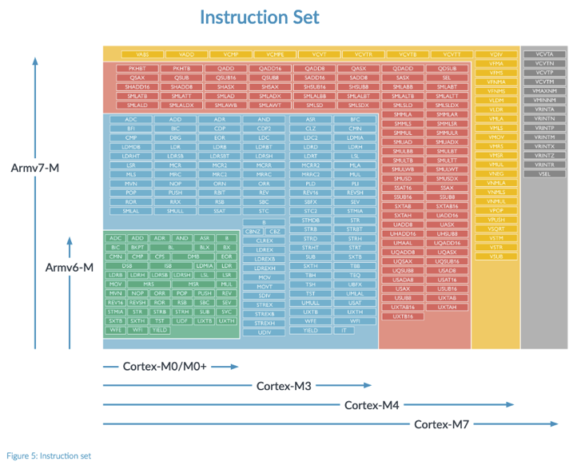

### Assembler

```asm
mov a, 10000 ; Grenzwert der Drehzahl
mov b, 30    ; Grenzwert der Temperatur
mov O,1      ; Abschaltsignal

:loop          ; Markierung im Programmfluss (keine Instruktion, wird vom Assembler für Sprungadressen verwendet)
in d,PORT1   ; einlesen der aktuellen drehzahl-Werte
in t,PORT2   ; einlesen der aktuellen temp-Werte

:drehcheck
cmp d,a      ; prüfe die Drehzahl
jg  tempcheck; wenn Grenzwert nicht erreicht, springe zu :tempcheck
out PORT3,O  ; Grenzwert erreicht! setze Abschaltsignal

:tempcheck
cmp t,b      ; prüfe die Temperatur
jg  loop     ; wenn Grenzwert nicht erreicht, springe zu :loop
out PORT3,O  ; Grenzwert erreicht! setze Abschaltsignal

jmp loop     ;unbedingter Sprung zur Marke :loop (Endlosschleife)
```

https://de.wikipedia.org/wiki/Echtzeitsystem

### Harvard vs von Neumann

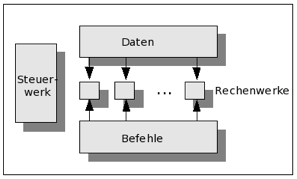 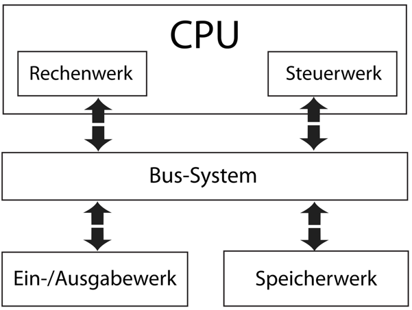

## SoC vs Microprocessor vs Microcontroller

### Microcontroller: ATmega328P

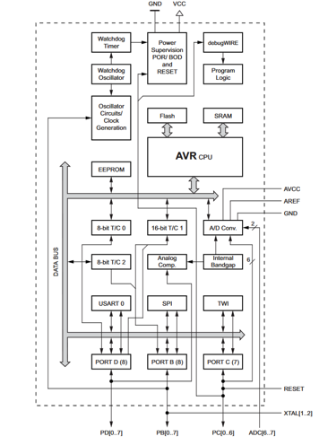

### System on Chip (SoC)

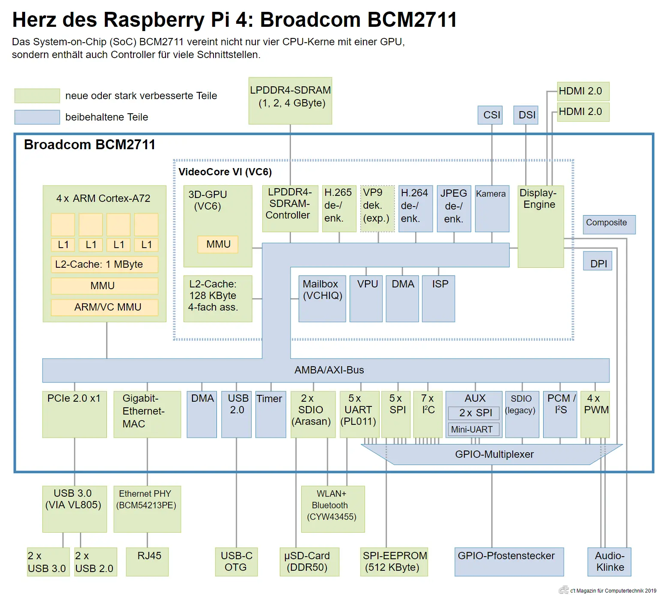

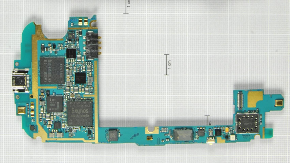

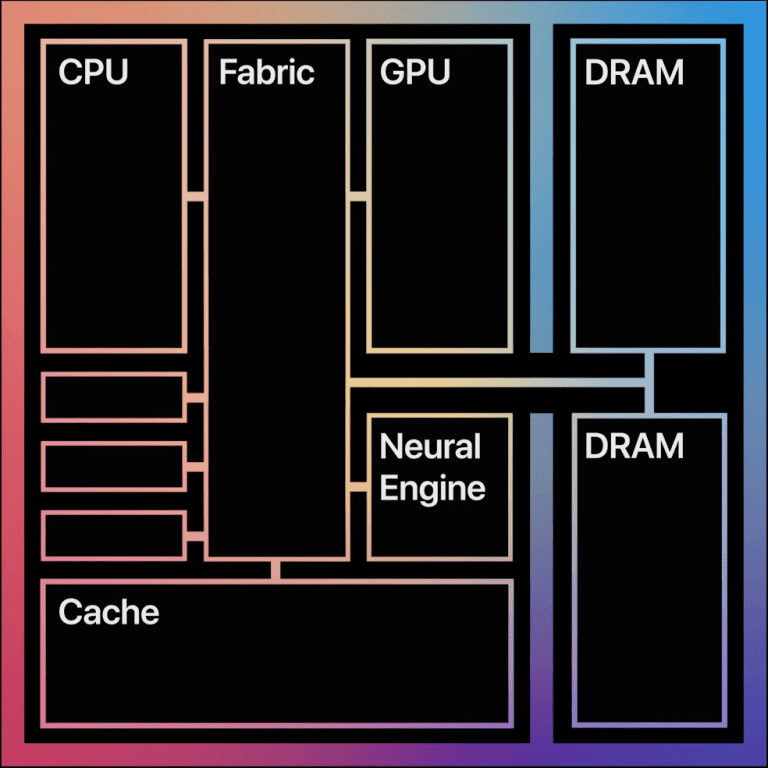


### Microprocessor: AMD Ryzen Threadripper

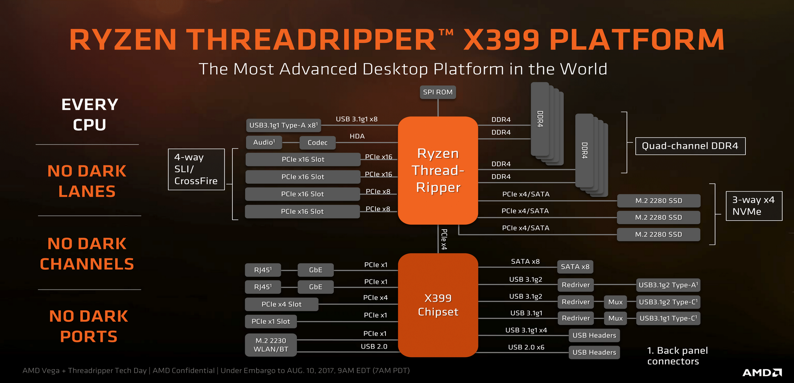
---
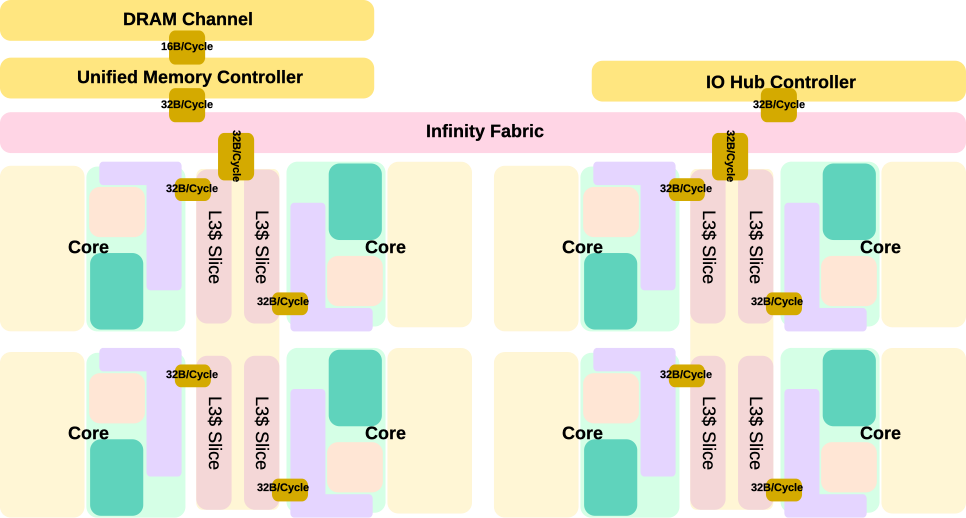

### Advanced RISC Machine (ARM)

> „ARM has an innovative business model.
> We license our technology to a network of Partners, mainly leading semiconductor companies.
> Every licensee pays an upfront fee to gain access to our technology designs.
> They then incorporate our designs alongside their own technology to create smart, energy-efficient chips.
> ARM receives a royalty on every chip sold that uses one of our technology designs.
> Typically our royalty is based on the price of the chip.“

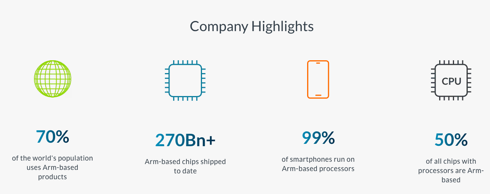

## RISC vs CISC

### Reduced Instruction Set Computer (RISC)

- Opcode hat eine feste Länge
- Meistens 1 Takt pro Operation
- Load/Store Architektur: Separate Lade und Speicher-Befehle
- Hohe Anzahl an Registern für Zwischenresultate
- Oft Harvard-Architektur
- Grundsätzlich: Einfachere Architektur, einfacher für Compiler
- Alles andere: CISC

### Pipelining

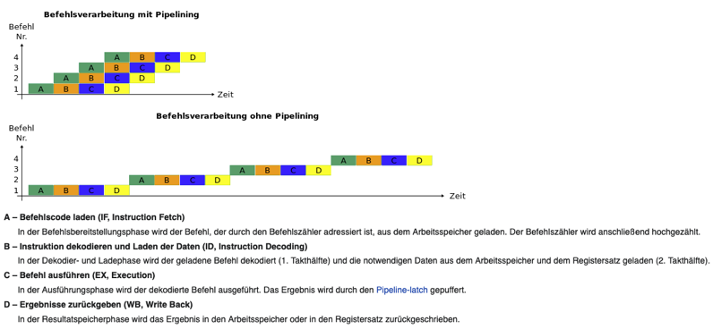
---
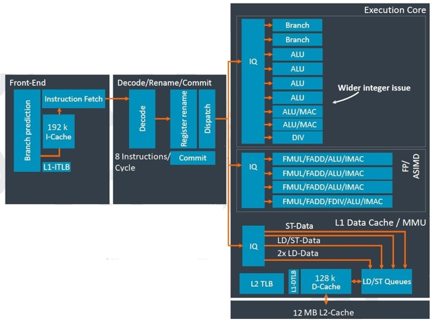