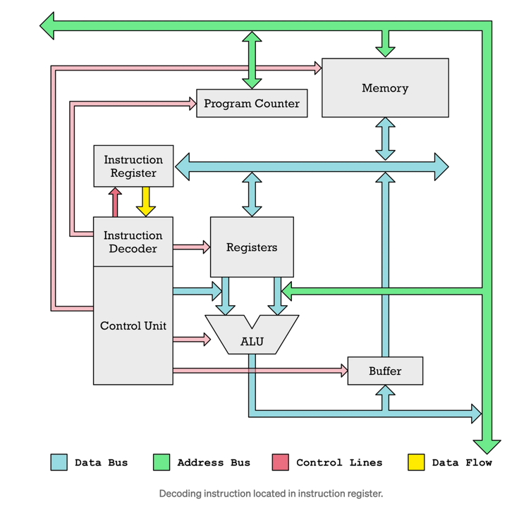

<!-- headingDivider: 4 -->
<style>
img {
  display: block;
  margin: 0 auto;
}
</style>

# Microcomputertechnik

## Überblick


## Software


---


Ken Thompson, Dennis Ritchie

### C Keywords (Auswahl)

```
bool (C23)   extern        sizeof         default     return
false (C23)  float         static         do          volatile
break        for           struct         double      short
case         goto          switch         else        signed
char         if            true (C23)     unsigned    register
const        int           typedef        void        union
continue     long                       
```

### Python Keywords

```
False 	     await        else         import        pass
None 	     break        except       in            raise
True 	     class        finally      is            return
and          continue     for          lambda        try
as           def          from         nonlocal      while
assert 	     del          global       not           with
async 	     elif         if           or            yield
```

### Go Keywords

```
break        default      func         interface    select
case         defer        go           map          struct
chan         else         goto         package      switch
const        fallthrough  if           range        type
continue     for          import       return       var
```

https://go.dev/ref/spec#Keywords

## Hochsprache zu Maschinencode

### Rust

```rust
pub fn square(num: i32) -> i32 {
    num * num
}
```

### Assembler

```asm
square:
        push    {r7, lr}
        sub     sp, #8
        smull   r1, r0, r0, r0
        mov     r2, r1
        str     r2, [sp, #4]
        cmp.w   r0, r1, asr #31
        bne     .LBB0_2
        b       .LBB0_1
.LBB0_1:
        ldr     r0, [sp, #4]
        add     sp, #8
        pop     {r7, pc}
.LBB0_2:
        ldr     r0, .LCPI0_0
.LPC0_0:
        add     r0, pc
        ldr     r2, .LCPI0_1
.LPC0_1:
        add     r2, pc
        movs    r1, #33
        bl      core::panicking::panic
        .inst.n 0xdefe
.LCPI0_0:
        .long   str.0-(.LPC0_0+4)
.LCPI0_1:
        .long   .L__unnamed_1-(.LPC0_1+4)
.L__unnamed_2:
        .ascii  "/app/example.rs"
.L__unnamed_1:
        .long   .L__unnamed_2
        .asciz  "\017\000\000\000\013\000\000\000\005\000\000"

str.0:
        .ascii  "attempt to multiply with overflow"
```
[godbolt.org](https://godbolt.org/e)


## Aufbau und Funktion eines Microprozessors



https://erik-engheim.medium.com/how-does-a-microprocessor-run-a-program-11744ab47d04

### AVR Architektur Blockschaltbild


### 1971: Intel 4004


### AMD Threadripper


### Apple M1


### ARM Cortex A67


### von Neumann Architektur


### Harvard Architektur


### Fetch - Decode - Execute


### Arithmetic Logic Unit (ALU)


---

Mindestens:

* Addition (ADD)
* Negation (NOT)
* Konjunktion (AND)

Zusätzlich (Auswahl):

* Subtraktion
* Vergleich
* Multiplikationen / Division
* Oder
* Shift / Rotation

## Instruction Set


http://lyons42.com/AVR/Opcodes/AVRAllOpcodes.html

### A64 Instruction Set


--- 


---


---


### Reduced Instruction Set Computer (RISC)

- Opcode hat eine feste Länge
- Meistens 1 Takt pro Operation
- Load/Store Architektur: Separate Lade und Speicher-Befehle
- Hohe Anzahl an Registern für Zwischenresultate
- Oft Harvard-Architektur
- Grundsätzlich: Einfachere Architektur, einfacher für Compiler
- Alles andere: **CISC**


## SoC vs Microprocessor vs Microcontroller

### Microcontroller: ATmega328P


### System on Chip (SoC)


--- 


Samsung Galaxy S3

---


Apple M1

### Microprocessor: AMD Ryzen Threadripper


---


### Advanced RISC Machine (ARM)

> "Arm licenses processor designs to semiconductor companies that incorporate the technology into their computer chips.
> Licensees pay an up-front fee to gain access to our technology, and a royalty on every chip that uses one of our technology designs.
> Typically, the royalty is based on the selling price of the chip." 

(https://group.softbank/en/ir/financials/annual_reports/2021/message/segars, 08.01.2024)

---


## Moore's Law


### Strukturgrösse


### TSMC


## Pipelining


## Speicher

### Cache


(Silberschatz, 2019)

---


(Silberschatz, 2019)

--- 


(Silberschatz, 2019)

## Quellen

Silberschatz, 2019
: A.Silberschatz, P.B.Galvin, G. Gagne (2019): Operating System Concepts, Global Edition, Wiley