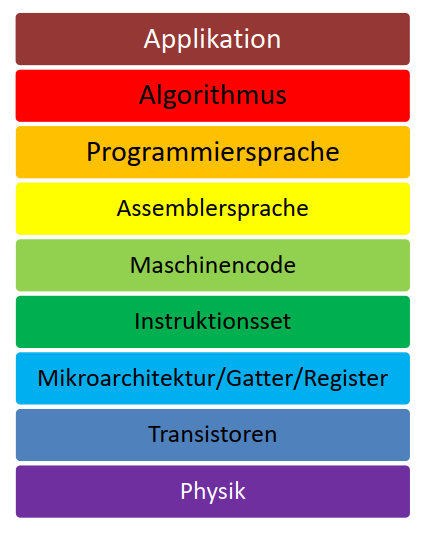

<!-- headingDivider: 4 -->
<style>
img {
  display: block;
  margin: 0 auto;
}
</style>

# Microcomputertechnik

## Überblick



## Alan Touring
- *1912 - †1954
- Begründer der «Computer Science»
- WWII: Massgeblich am Knacken der deutschen Enigma-Verschlüsselung beteiligt
- Verfolgt und «therapiert» wegen Homosexualität
- Vermutlich Selbstmord
- The Imitation Game, Benedict Cumberbatch

## Turingmaschine
Die Turingmaschine hat ein Steuerwerk, in dem sich das Programm befindet, und besteht außerdem aus
- einem unendlich langen Speicherband mit unendlich vielen sequentiell angeordneten Feldern.
- einem programmgesteuerten Lese- und Schreibkopf, der sich auf dem Speicherband feldweise bewegen und die Zeichen verändern kann.
- Turing bewies, dass solch ein Gerät in der Lage ist, „jedes vorstellbare mathematische Problem zu lösen, sofern dieses auch durch einen Algorithmus gelöst werden kann“.

## Turingvollständigkeit
«Exakt ausgedrückt bezeichnet Turing-Vollständigkeit in der Berechenbarkeitstheorie die Eigenschaft einer Programmiersprache oder eines anderen logischen Systems, sämtliche Funktionen berechnen zu können, die eine universelle Turingmaschine berechnen kann.»
(https://de.wikipedia.org/wiki/Turing-Vollst%C3%A4ndigkeit)

## Halteproblem

«Das Halteproblem beschreibt die Frage, ob die Ausführung eines Algorithmus zu einem Ende gelangt. Obwohl das für viele Algorithmen leicht beantwortet werden kann, konnte der Mathematiker Alan Turing beweisen, dass es keinen Algorithmus gibt, der diese Frage für alle möglichen Algorithmen und beliebige Eingaben beantwortet.»
(https://de.wikipedia.org/wiki/Halteproblem)

Wir müssen sicherstellen, dass unsere Programme nicht unabsichtlich endlos weiterlaufen!

## Turing-Test


## Software


---


Ken Thompson, Dennis Ritchie

### C Keywords (Auswahl)

```
bool (C23)   extern        sizeof         default     return
false (C23)  float         static         do          volatile
break        for           struct         double      short
case         goto          switch         else        signed
char         if            true (C23)     unsigned    register
const        int           typedef        void        union
continue     long                       
```

### Python Keywords

```
False 	     await        else         import        pass
None 	     break        except       in            raise
True 	     class        finally      is            return
and          continue     for          lambda        try
as           def          from         nonlocal      while
assert 	     del          global       not           with
async 	     elif         if           or            yield
```

### Go Keywords

```
break        default      func         interface    select
case         defer        go           map          struct
chan         else         goto         package      switch
const        fallthrough  if           range        type
continue     for          import       return       var
```

https://go.dev/ref/spec#Keywords

## Hochsprache zu Maschinencode

### 4. Generation
- SQL
- Unix Shell
- LabVIEW
- Stata
- R
- MATLAB
- MaxMSP

### Programmiersprachen der 3. Generation
- ALGOL
- Cobol
- Fortran
- C, C++
- C#
- Java
- Python
- Go
- Rust
- JavaScript
- etc.

### Rust

```rust
pub fn square(num: i32) -> i32 {
    num * num
}
```


## Assembler (2. Generation)

### Assembler

```asm
square:
        push    {r7, lr}
        sub     sp, #8
        smull   r1, r0, r0, r0
        mov     r2, r1
        str     r2, [sp, #4]
        cmp.w   r0, r1, asr #31
        bne     .LBB0_2
        b       .LBB0_1
.LBB0_1:
        ldr     r0, [sp, #4]
        add     sp, #8
        pop     {r7, pc}
.LBB0_2:
        ldr     r0, .LCPI0_0
.LPC0_0:
        add     r0, pc
        ldr     r2, .LCPI0_1
.LPC0_1:
        add     r2, pc
        movs    r1, #33
        bl      core::panicking::panic
        .inst.n 0xdefe
.LCPI0_0:
        .long   str.0-(.LPC0_0+4)
.LCPI0_1:
        .long   .L__unnamed_1-(.LPC0_1+4)
.L__unnamed_2:
        .ascii  "/app/example.rs"
.L__unnamed_1:
        .long   .L__unnamed_2
        .asciz  "\017\000\000\000\013\000\000\000\005\000\000"

str.0:
        .ascii  "attempt to multiply with overflow"
```
[godbolt.org](https://godbolt.org/e)

## Maschinensprache (1. Generation)


## Aufbau und Funktion eines Microprozessors

(vgl. https://erik-engheim.medium.com/how-does-a-microprocessor-run-a-program-11744ab47d04)

### AVR Architektur Blockschaltbild


### 1971: Intel 4004


### AMD Threadripper


### Apple M1


### ARM Cortex A67


### von Neumann Architektur

- Befehle werden aus einer Zelle des Speichers gelesen und dann ausgeführt.
- Normalerweise wird dann der Inhalt des Befehlszählers um Eins erhöht.
- Es gibt Verzweigungs-Befehle, die in Abhängigkeit vom Wert eines Entscheidungs-Bit den Befehlszähler um Eins erhöhen oder um einen anderen Wert verändern


### Harvard Architektur


### Fetch - Decode - Execute


### Arithmetic Logic Unit (ALU)


---

Mindestens:

* Addition (ADD)
* Negation (NOT)
* Konjunktion (AND)

Zusätzlich (Auswahl):

* Subtraktion
* Vergleich
* Multiplikationen / Division
* Oder
* Shift / Rotation

## Instruction Set


http://lyons42.com/AVR/Opcodes/AVRAllOpcodes.html

### A64 Instruction Set


--- 


---


---


### Reduced Instruction Set Computer (RISC)

- Opcode hat eine feste Länge
- Meistens 1 Takt pro Operation
- Load/Store Architektur: Separate Lade und Speicher-Befehle
- Hohe Anzahl an Registern für Zwischenresultate
- Oft Harvard-Architektur
- Grundsätzlich: Einfachere Architektur, einfacher für Compiler
- Alles andere: **CISC**

---

### Reduced Instruction Set Computer (RISC)

- Besser geeignet für "moderne" Compiler
- Intel / AMD haben lange den CPU Markt mit CISC CPUs dominiert
- Im mobile und embedded Bereich ist ARM (RISC) extrem verbreitet
- Seit 2020 gibt es auch im Desktop wieder RISC Systeme (Apple M1) mit grossen Vorteilen in der Effizienz
- Verschiedene Hersteller bieten auch für RISC Server-CPUs an die v.a. bei Cloud Anbietern (AWS, Google, etc) Verbreitung finden

## SoC vs Microprocessor vs Microcontroller

### Microcontroller: ATmega328P


### System on Chip (SoC)


--- 


Samsung Galaxy S3

---


Apple M1

### Microprocessor: AMD Ryzen Threadripper


---


### Advanced RISC Machine (ARM)

> "Arm licenses processor designs to semiconductor companies that incorporate the technology into their computer chips.
> Licensees pay an up-front fee to gain access to our technology, and a royalty on every chip that uses one of our technology designs.
> Typically, the royalty is based on the selling price of the chip." 

(https://group.softbank/en/ir/financials/annual_reports/2021/message/segars, 08.01.2024)

---


## Moore's Law


---


https://www.zdnet.com/article/ai-is-changing-the-entire-nature-of-compute/
(Patterson, Hennessy, 2014, S.44)

### Strukturgrösse


### TSMC


## Pipelining


## Speicher

### Cache


(Silberschatz, 2019)

---


(Silberschatz, 2019)

--- 


(Silberschatz, 2019)

## Zahlendarstellung und Datentypen
- Binäre Zahlen: Für Maschinen einfach darstellbar (2 mögliche Zustände, idR. Spannungen)

### Integer
- Ganze Zahlen
- Natürliche Zahlen (Negativ): Das MSB (most significant bit) wird für das Vorzeichen verwendet

### Fliesskommazahlen
- Normiert in IEEE 754
- `x = s • m • b^e`
    - Vorzeichen s
    - Mantisse m
    - Basis b (b=2)
    - Exponent e


### Floating Point: Präzision


### Strings
- Array von Buchstaben (Char)
  

## Datentypen in Go (Auswahl)
`bool` boolean, 1-bit, true or false
`int8`	8-bit signed integer (-128 bis 127)
`int16`	16-bit signed integer (-32'768 bis 32'767)
`int32`	32-bit signed integer (−2'147'483'648 bis 2'147'483'647)
`uint8`	8-bit unsigned integer (0 bis 255)
`float32` 32-bit IEEE 754 floating-point number (1.2E−38 bis 3.4E38)
`string` "Sequence of Unicode code points"

### Statische Typisierung

- Zur Laufzeit hat jedes Objekt einen (Daten)typ
- Im Programmtext hat jeder Ausdruck einen Typ → Der Typ ist zum Zeitpunkt der Kompilierung bekannt
- Vorteile
    - Fehler können früher erkannt werden
    - Effizientere Programme, da keine Typprüfung während der Laufzeit
    - Mehr Optimierungsmöglichkeiten durch Compiler
- statisch typisierte Sprachen: Java, Kotlin, C#, C, Go, Rust
  

### Datentypen in Python (Auswahl)
- `str`
- `int` (Kein Limit)
- `float` (64Bit IEEE 754))
- `complex`
- `bool`

### Dynamische Typisierung

- Zur Laufzeit hat jedes Objekt einen Typ
- Der Typ wird zur Laufzeit geprüft
- Duck Typing: “When I see a bird that walks like a duck and swims like a duck and quacks like a duck, I call that bird a duck.”
- Vorteile
  - Einfachere Programmierung
- Durch Typehints kann die IDE uns bei der Entwicklung dennoch unterstützen
  - `def greeting(name: str) -> str:`
- dynamisch typisierte Sprachen: PHP, Python, Ruby, JavaScript


## Finite State Machine


---


## Automatentheorie


### Turing-Maschine


## Quellen

Silberschatz, 2019
: A.Silberschatz, P.B.Galvin, G. Gagne (2019): Operating System Concepts, Global Edition, Wiley

Patterson, Hennessy, 2014
: D.A.Patterson, J.L.Hennesy (2014): Computer Organization and Design - The Hardware / Software Interface, Fifth Edition, Morgan Kaufmann